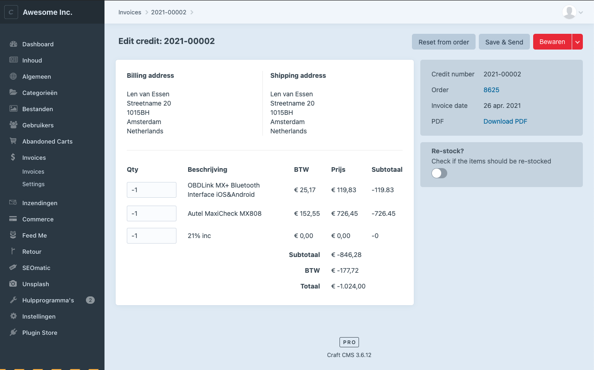

# Commerce Invoices plugin for Craft CMS 3.x

Craft Commerce is great! Their PDF system is pretty awesome to. However, pdf of a does not equal an invoice, invoices should be: Immutable and sequentially numbered.

Commerce Invoices is an extension for Craft Commerce that allows you to:
- Create PDF invoices for orders (automatically if they reach a certain status, or manually)
- (Partially) Credit an invoice, create a credit-note 
- Automatically re-stock your inventory when you (partially) credit a order
- Keep a solid invoice history, immutable and irreversible so that your accountant will be a happy man (or woman, or any other pronoun)

## Requirements

This plugin requires Craft CMS 3.0.0-beta.23 or later.

## Installation

To install the plugin, follow these instructions.

1. Open your terminal and go to your Craft project:

        cd /path/to/project

2. Then tell Composer to load the plugin:

        composer require lenvanessen/commerce-invoices

3. In the Control Panel, go to Settings → Plugins and click the “Install” button for Commerce Invoices.

## Configuring Commerce Invoices

### Setting up e-mails & PDFs
This extension integrates nicely with Craft's built-in system for Commerce E-mails and PDFs.
However, there is a slight deviation. Normally, you'd trigger an email by assigning it to a specific order status. If you want the PDF of an invoice to be attached, this will not work like this.
This is due to the fact that one order can contain multiple Invoices, and Multiple Credit Invoices. So just because the order reaches a status, doesn't mean the plugin knows what pdf you want sent to the customer.

The same principle applies to Craft's native PDFs. You can create PDFs from Crafts internal system, but they only get the `order` variable and are linked to a specific order, not to an invoice or credit invoice. For this reason, we don't assign a native PDF to the e-mail we're about to create, it will be added automatically.

The correct set-up is as follows:
1. Go to Craft Commerce and create a new e-mail. You can assign a PDF, as long as it's not the pdf for the invoice (which you shoundn't have created anyways;)
2. Go to Invoices > Settings and select the newly created email. While your here, you can also select the PDF template for the invoice.
3. Done;)

### Building the invoice PDF
You can easily check a preview of the invoice by navigation to:
https://yourlocaltest.dev/commerce-invoices/style-pdf

By passing a specific invoice id you can test certain invoices, using the query parameter ?invoiceId={ID}. This is useful if you want to test a specific scenario or have problems with specific invoices. It's not necessary, you can also leave it blank and it will get the last invoice. 

The only condition is that your site is not in production mode. You can also find a example PDF in the sourcecode of this extension, under templates.

## Commerce Invoices Roadmap

Some things to do, and ideas for potential features:

* Automatic refund creation
* Release it 

Brought to you by [Len van Essen](wndr.digital)

Icons made by <a href="https://www.flaticon.com/authors/pixel-perfect" title="Pixel perfect">Pixel perfect</a> from <a href="https://www.flaticon.com/" title="Flaticon">www.flaticon.com</a>

